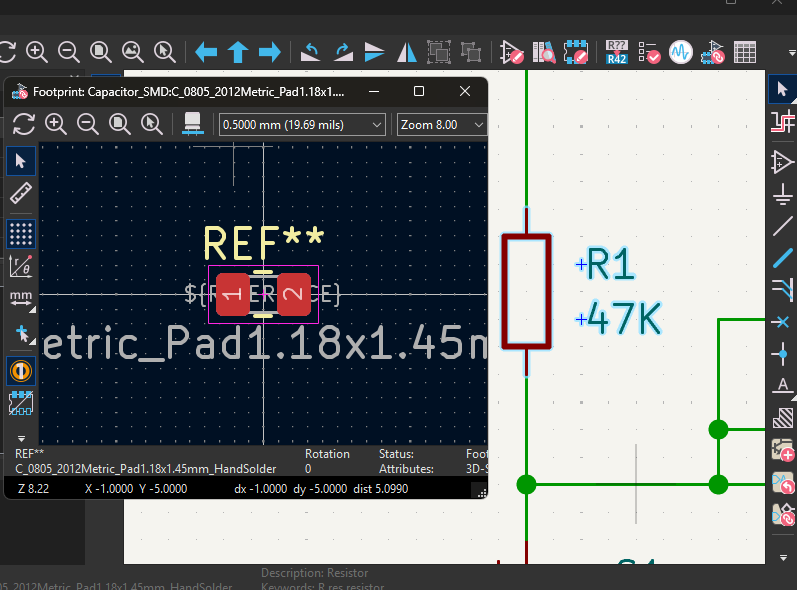

# Seven_Segment_Counter
This project is part of From Schematic to PCB: Layout Fundamentals Course

Correct footprint mapping and PCB design rule setup are foundational to Design for Manufacturability (DFM) and reliable circuit assembly. In electronic hardware development, a schematic only establishes logical connectivity; the physical footprint defines the exact mechanical geometry, pad dimensions, pitch, and pin assignments required for soldering. If footprint mapping is incorrect—such as misaligned pinouts on ICs or inverted diode/LED polarities—the board becomes non-functional, causing catastrophic failures like short circuits or permanent semiconductor damage.
Similarly, establishing proper PCB design rules (trace width, clearance, annular ring size, and solder mask expansion) ensures that fabrication shops can manufacture the board within acceptable tolerances. Overlooking these constraints leads to severe fabrication defects, including etched trace open-circuits, solder bridging during reflow, and thermal dissipation failures. Ultimately, rigorous rule verification and footprint validation eliminate costly re-spins, optimize assembly yield, and guarantee long-term operational integrity.

